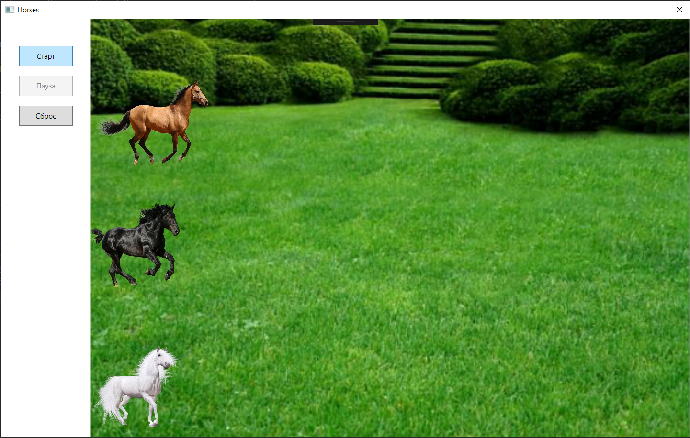
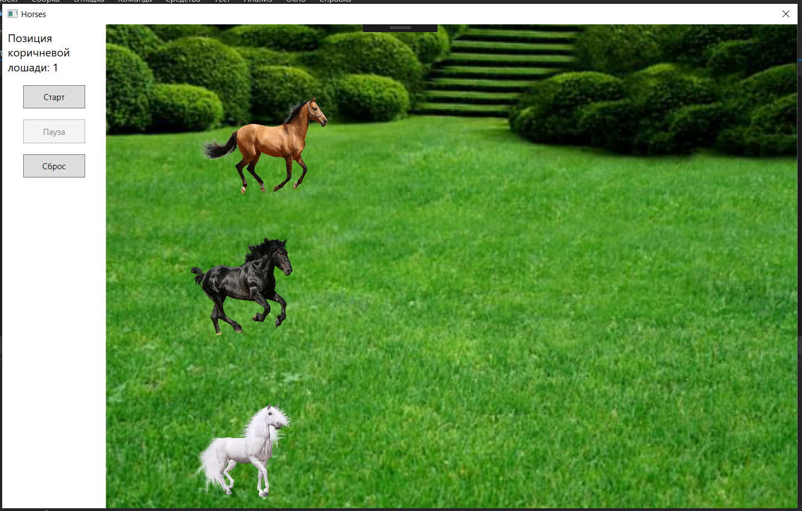
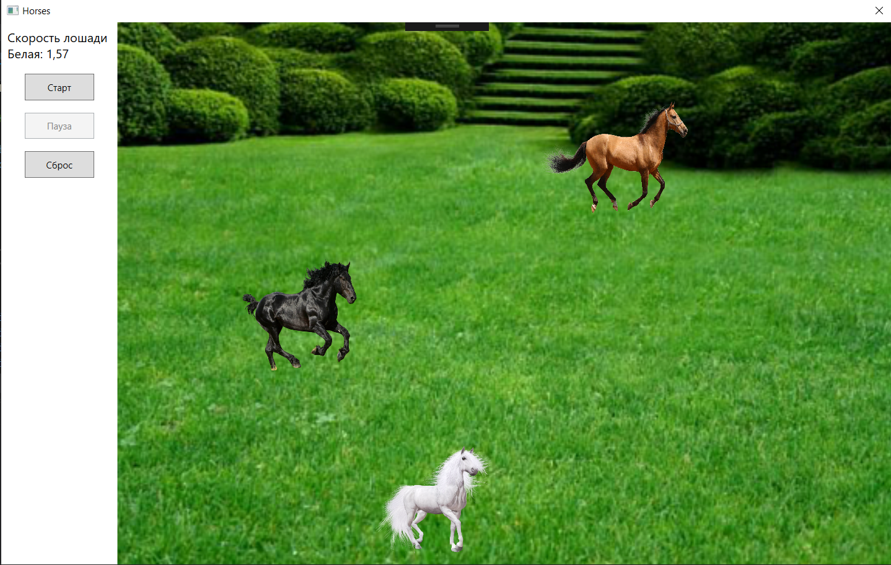

# WPF_Laba4
Вариант 2
Разработать пльзовательский эелемент управления, реализующий игру "Бег лошадей по прямой". Скорость движения лошадей должна задаваться случайным образом. При щелчке правой клавиши мыши по изображению лошади должна выводиться информация о ее скорости, при щелчке левой клавишей мыши - информация о ее позиции.

Начальное положение

Позиция при клике на левую клавишу

Скорость при клике на правую

